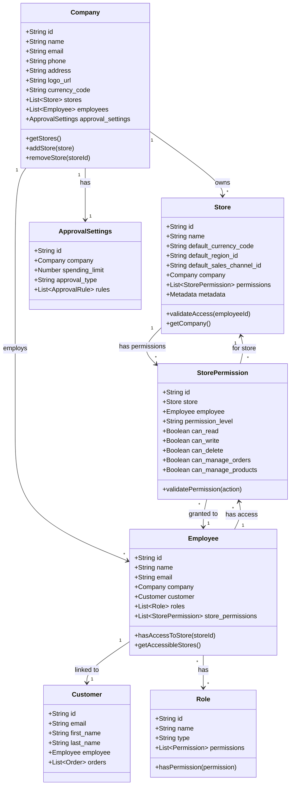
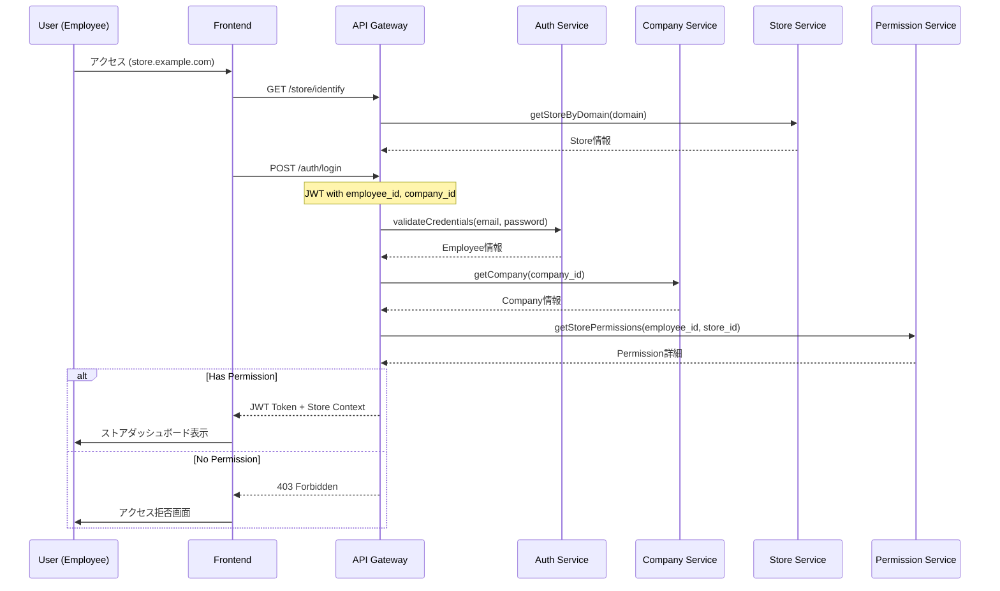
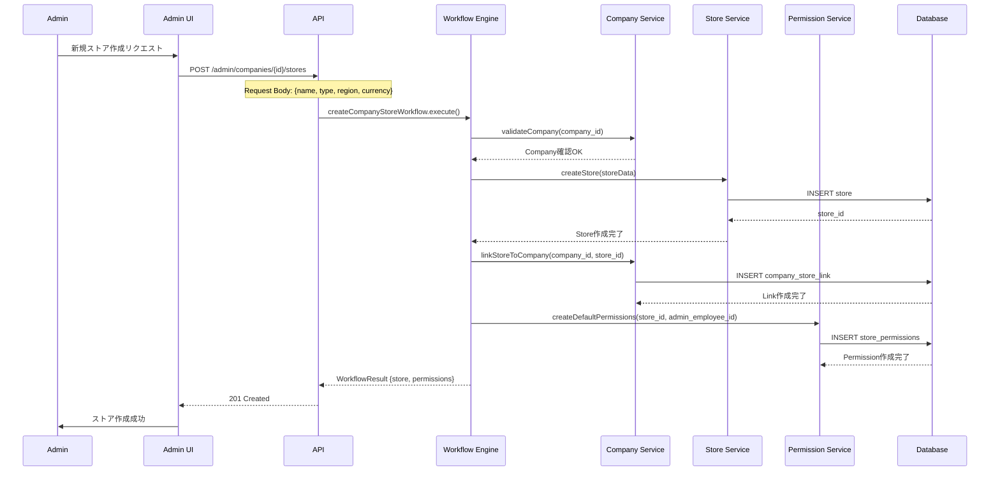
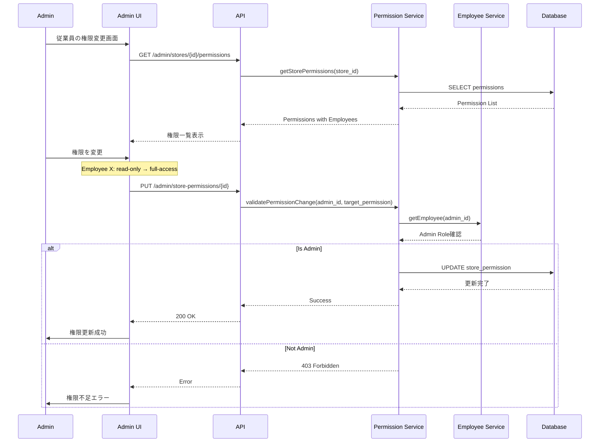

# SaaS型ECプラットフォーム マルチテナント構成

## アーキテクチャ概要

```
┌─────────────────────────────────────┐
│   SaaS型ECプラットフォーム           │
│   (Medusa Backend - 共通)           │
└──────────┬──────────┬───────────────┘
           │          │
    ┌──────▼──┐  ┌───▼────┐  ┌──────┐
    │ 三省堂  │  │ 会社A  │  │会社B │
    └────┬────┘  └──┬───┬─┘  └─┬──┬─┘
         │         │     │      │    │
    ┌────▼───┐ ┌──▼─┐┌─▼─┐ ┌─▼─┐┌─▼─┐
    │サイトC │ │ E │ │ F │ │ G ││ H │
    │一般向け│ │一般│ │法人│ │日本││海外│
    └────────┘ └────┘ └───┘ └───┘└────┘
```

## 実装方式

### 1. テナント（会社）の分離
- **Company Module**: 各会社（三省堂、会社A、会社B）を管理
- **Store Module**: 各サイト（C, E, F, G, H）を個別のストアとして管理
- **データ分離**: store_idによる完全なデータ分離

### 2. 階層構造
```typescript
// 会社 → ストア の関係
Company (三省堂)
  └── Store (サイトC - 一般消費者向け)

Company (会社A)
  ├── Store (サイトE - 一般消費者向け)
  └── Store (サイトF - 法人向け)

Company (会社B)
  ├── Store (サイトG - 日本向け)
  └── Store (サイトH - 海外向け)
```

### 3. 各モジュールの役割

#### Company Module（既存）
- 企業管理
- 従業員管理
- 支出制限管理
- 承認フロー設定

#### Store Module（Medusa標準）
- 各サイトの独立した運営
- 商品カタログの分離
- 価格設定の独立管理
- 在庫管理の分離

#### カスタム拡張が必要な機能
1. **Company-Store リンク**
   - 1つの会社が複数のストアを持てる関係性
   - ストアごとの権限管理

2. **テナント別フロントエンド**
   - ドメイン/サブドメインによる振り分け
   - テナント別UIテーマ
   - カスタムブランディング

## 実装ステップ

### Phase 1: データモデル拡張
1. CompanyとStoreの関連付け
2. テナント識別子の追加
3. 権限モデルの拡張

### Phase 2: API層の実装
1. テナント別API分離
2. 認証・認可の実装
3. データフィルタリング

### Phase 3: フロントエンド構成
1. マルチサイト対応
2. 動的テーマ切り替え
3. テナント別ルーティング

### Phase 4: 運用機能
1. テナント管理画面
2. 使用量モニタリング
3. 課金システム連携

## Company-Store リンクの詳細設計

### クラス図



### シーケンス図

#### 1. ストアへのアクセス認証フロー



#### 2. 新規ストア作成フロー



#### 3. 権限管理フロー



## データモデル詳細

### 1. Company-Store リレーション
```typescript
// Company Model Extension
interface Company {
  id: string;
  name: string;
  stores: Store[];  // 1対多の関係
  employees: Employee[];
  approval_settings: ApprovalSettings;
}

// Store Model Extension
interface Store {
  id: string;
  name: string;
  company_id: string;  // 所属する会社
  company: Company;
  store_type: 'b2c' | 'b2b' | 'marketplace';
  target_market: 'domestic' | 'international';
  permissions: StorePermission[];
  metadata: {
    subdomain?: string;
    custom_domain?: string;
    theme?: string;
    locale?: string;
  };
}
```

### 2. 権限モデル
```typescript
// Permission Model
interface StorePermission {
  id: string;
  store_id: string;
  employee_id: string;
  permission_level: 'viewer' | 'editor' | 'manager' | 'admin';
  
  // 詳細権限
  can_read: boolean;
  can_write: boolean;
  can_delete: boolean;
  can_manage_orders: boolean;
  can_manage_products: boolean;
  can_manage_customers: boolean;
  can_manage_employees: boolean;
  can_view_analytics: boolean;
  
  created_at: Date;
  updated_at: Date;
}

// Role Model for Company-wide permissions
interface CompanyRole {
  id: string;
  company_id: string;
  name: string;
  type: 'super_admin' | 'company_admin' | 'store_manager' | 'employee';
  permissions: string[];  // List of permission keys
}
```

## 技術的考慮事項

### セキュリティ
- テナント間のデータ完全分離
- APIレベルでのアクセス制御
- 監査ログの実装
- **データ分離**: store_idベースの完全なデータ分離
- **権限チェック**: すべてのAPIエンドポイントで権限検証
- **監査ログ**: 権限変更の履歴を記録

### パフォーマンス
- テナント別キャッシュ戦略
- データベースインデックス最適化
- CDN活用による配信最適化
- **権限キャッシュ**: Redis等でユーザー権限をキャッシュ
- **遅延読み込み**: ストア情報の必要な部分のみ取得
- **インデックス**: company_id, store_id, employee_idに適切なインデックス

### スケーラビリティ
- 水平スケーリング対応
- テナント別リソース制限
- 自動スケーリング設定
- **プラグイン対応**: ストアごとの機能拡張
- **WebHook**: ストア作成・権限変更時のイベント通知
- **API Rate Limiting**: ストアごとのAPIレート制限